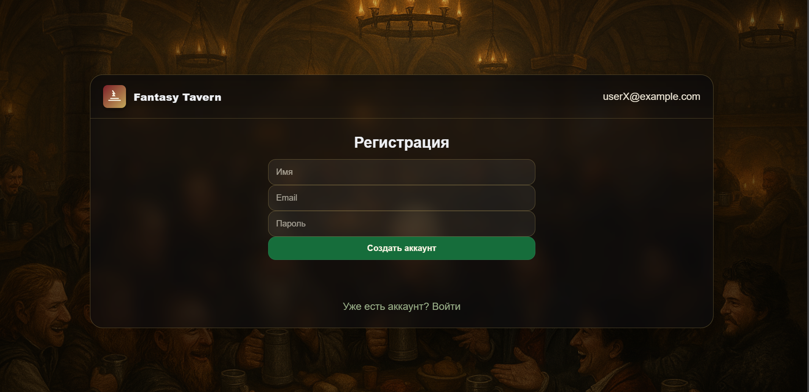

## Микросервисное приложение для бронирования столов в ресторане
Проект представляет собой микросервисное веб-приложение, реализованное в соответствии с **REST** **API**. Реализована аутентификация, создание аккаунта и выдача персонального **JWT** токена, возможность бронировать столик. В рамках проекта для наработки навыков были использованы и **Kafka** и **gRPC**. Было проведено интеграционное тестирование. Используемые технологии: **Java**, **Spring** **Boot**, **Hibernate**, **PostgreSQL**, **Kafka**, **gRPC**, **JUnit**, **Rest** **Assured**, **Spring** **Cloud** **Gateway**.

## Аутентификация
### Вход и регистрация
Для входа в аккаунт нужно ввести адрес электронной почты и пароль. Обработка идёт при помощи **_auth-service_**, для которого создаётся соответсвующая база данных. Пароль хранится в зашифрованном виде. **Auth-service** выдаёт подписанный **JWT** токен пользователю. При отсутствии у пользователя он может его создать.

## Бронирование
На главной странице можно забронировать столик при помощи **_client-service_**. При выборе времени и даты бронирования отображаются только доступные в этот период времени столы (никем ещё не занятые). Бронировать столик не обязательно на того пользователя, чей это аккаунт (но по умолчанию форма заполнена для него). Помимо этого сразу можно сделать заказ блюд тз доступных в ассортименте. Отдельная БД создаётся для **client-service**. Пример такой БД внутри модуля создаётся при помощи **data.sql**.

